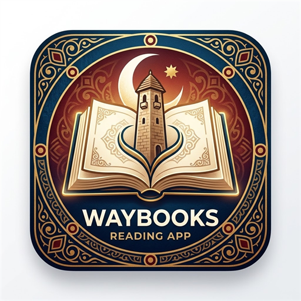

# 📚 WayBooks — Офлайн-читалка на Android

  

  <b>WayBooks</b> — читалка, которая работает без интернета: 104 полных текстов встроено, свои обложки, EPUB, FB2, PDF и TXT, четыре темы и счётчик страниц.

  <a href="download/WayBooks-1.4.apk"><b>📥 Скачать WayBooks-1.4.apk (19.5 МБ)</b></a>

---

## ✨ Ключевые особенности

* 📱 **100% Офлайн:** Никаких запросов в сеть, аккаунтов или подписок. Книги, настройки и прогресс чтения хранятся исключительно в памяти вашего телефона.
* 📖 **104 полные книги уже внутри:**
  * 48 классических произведений русской литературы (Толстой, Достоевский, Чехов, Булгаков и др.)
  * 16 произведений вайнахской литературы и фольклора (чеченские и ингушские сказки, легенды, поэзия)
  * 40 исламских богословских трудов и трактатов
* 🌐 **Многоязычный интерфейс:**
  * Русский язык
  * **Нохчийн мотт (чеченский интерфейс)** — полная вычитка по национальному корпусу («Доьшуш ду», «Деша лаьа», «ДӀадешна»)
  * Английский язык
* 📂 **Свои книги:** Импортируйте файлы в форматах **EPUB**, **FB2**, **PDF** и **TXT**.
* 🎨 **4 темы оформления:** Светлая, Сепия, Тёмная и Глубокая чёрная (OLED-friendly).
* 🔖 **Умные заметки и цитаты:** Выделение фрагментов пальцем с автоматическим сохранением цитат в блокнот книги.

---

## 🚀 Установка

1. Скачайте актуальный файл **[WayBooks-1.4.apk](download/WayBooks-1.4.apk)** (19.5 МБ).
2. Разрешите установку приложений из «неизвестных источников» в настройках Android.
3. Откройте приложение — вся библиотека доступна мгновенно.

---

## 📄 Лицензия

WayBooks. Сделано с заботой о сохранении чтения и родного языка.
